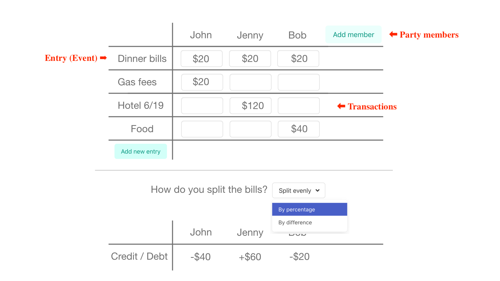

# Groupense

Created: May 27, 2021 10:04 PM

## About Groupense

- Groupense is a simple web app that allows you to keep track of expenses for each member in a group. You can use it for group trips, club activities, and many more. (In development)

    **Groupense Mockup**

    

## Demo

- API demo & documentation are running at [**https://groupense.herokuapp.com/docs**](https://groupense.herokuapp.com/docs). It may take a while to load as it runs on a free tier Heroku server.
